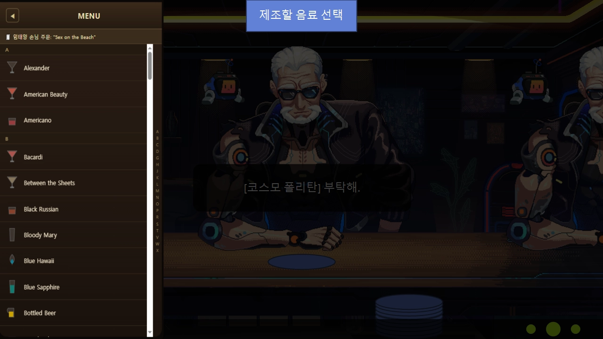

# 스터 미니게임

생성자: 이준서 
생성 일시: 2026년 8월 10일 오후 10:22
문서 태그: 시스템
PIN: No
상태: 진행 중

> 현 문서는 최종 UI 배치와 그래픽 연출을 확정하기 위한 문서가 아닌
 스터 기믹의 입력·판정·진행 구조를 구현하기 위한 기능 명세.

프로토타입의 화면 구성과 UI·UX 효과는 참고 자료로만 사용. 
현재 구현에서는 필요한 상태와 판정 결과를 텍스트 또는 로그로 확인, 
최종 UI와 연출은 관련 작업자들과 별도로 확정.
> 

# 스터 기믹 시스템

## 참조 프로토타입

[스터미니게임(GPT버전).html](%E1%84%89%E1%85%B3%E1%84%90%E1%85%A5%E1%84%86%E1%85%B5%E1%84%82%E1%85%B5%E1%84%80%E1%85%A6%E1%84%8B%E1%85%B5%E1%86%B7(GPT%E1%84%87%E1%85%A5%E1%84%8C%E1%85%A5%E1%86%AB).html)

### 플레이 하기

[스터미니게임(GPT버전).html](%E1%84%89%E1%85%B3%E1%84%90%E1%85%A5%E1%84%86%E1%85%B5%E1%84%82%E1%85%B5%E1%84%80%E1%85%A6%E1%84%8B%E1%85%B5%E1%86%B7(GPT%E1%84%87%E1%85%A5%E1%84%8C%E1%85%A5%E1%86%AB)%201.html)

---

## 1. 개요와 진입

- 스터는 제조의 mix 단계에서 실행되는 기믹이다.
- 진입 조건은 `cocktails.json → mix` 값이 `stir`인 칵테일이다 — 현재 dry_martini 1종(T2).
- 이 기믹은 `build` 방식의 칵테일에는 적용하지 않는다.
- 기믹이 끝나면 결과(완성도·판정 내역)를 제조 시스템에 넘긴다 — 최종 등급 연계는 §4.
- 기믹 진행 중 바 좌석의 인내심 타이머와 스폰 대기는 전부 정지한다 — 제조 중 정지 공통 규칙.

---

## 2. 화면 구성

| 영역 | 위치 | 내용 |
| --- | --- | --- |
| 연출 애니메이션 (젓기) | 사선 왼쪽 (화면의 30~40%) | 캐릭터가 믹싱 글라스를 젓는 모습. 판정 없음 — 입력 상태를 반영만 한다 |
| 기믹 입력 | 사선 오른쪽 | 탑다운 잔 + 4방위 키 배지 + 바 스푼 시침. 실제 입력·판정 영역 |
| 진행 게이지 | 사선 분할선 위 | 사선과 같은 기울기. 아래에서 위로 차오른다 |
| HUD | 우측 상단 | 걸린 시간 · 스택 n/N |
| 종료 버튼 | 우측 하단 | 스택이 다 차면 활성화 |

### 2.1 연출 영역 (왼쪽)

- 캐릭터는 정면 시점, 얼굴은 하관(턱·입)만 보인다.
- 손은 잔 위 중앙에 고정되고 미세하게만 움직인다 — 손가락으로 스푼을 굴리는 스터 방식.
- 스푼 헤드는 잔 바닥 가장자리를 큰 원으로 돈다. 헤드가 왼쪽이면 손잡이 끝은 오른쪽 위로 기우는 지렛대 움직임이 된다.
- 잔 속 얼음이 젓는 속도에 끌려 돌고, 젓지 않으면 서서히 멈춘다.

### 2.2 기믹 영역 (오른쪽)

- 탑다운 잔: 내부에 얼음과 바 스푼이 보인다.
- 바 스푼은 잔 중심에 피벗을 둔 시침 형태다 — 현재 방위를 가리키고, 정답 입력마다 시계 방향으로 90° 굴러간다.
- 잔 가장자리 4방위에 키 배지: 위 W · 오른쪽 D · 아래 S · 왼쪽 A. 배치는 고정이다.
- 잔 둘레의 링이 시도 제한시간 타이머다 — 남은 시간만큼 줄어들고, 34% 미만에서 경고색으로 바뀐다.

### 2.3 키 배지 상태 (4종)

| 상태 | 표시 | 의미 |
| --- | --- | --- |
| 현재 | 진한 녹색 테두리 | 스푼이 가리키는 방위 |
| 다음 | 밝은 녹색 테두리 펄스 | 지금 눌러야 하는 키 (다음으로 눌러야하는) |
| 정답 | ~~초록 플래시~~ | 방금 맞힌 키 |
| 오답 | ~~빨강 플래시~~ | 방금 틀린 키. 화면 흔들림 + WRONG 팝 동반 |

### ~~2.4 진행 게이지~~

- 게이지는 스택 수(10)만큼의 칸으로 나뉘고, 칸 사이는 얇은 구분선으로 표시한다.
- 시도 하나가 끝날 때마다 칸 하나가 찬다 — 성공 스택은 금색, 실패 스택은 어두운 적색.
- 게이지가 끝까지 차면(스택 10칸 소진) 종료 버튼이 활성화되고 강조 펄스를 재생한다.

---

## 3. 조작과 코어 루프

- 입력: WASD 또는 화살표 키 — 동일 처리.
- 시도 = 성공·실패 판정 하나를 만드는 입력 사이클. 성공한 시도 = 기준 위치에서 시계 방향 4입력으로 다시 기준 위치까지 도는 한 바퀴 — 항상 현재 방위의 시계 방향 이웃 키만 정답.

| 상황 | 처리 |
| --- | --- |
| 진입 직후 | 시작 대기 — 모든 타이머 정지. W 외 입력은 실패 처리 없이 무시 |
| 첫 W 입력 | 스터 시작 + 제한시간 2.0초 시작. 첫 W는 4입력에 미포함 — 이후 D → S → A → W 순으로 누르면 첫 성공 |
| 성공 | 스푼 위치와 시도 내 성공 수 갱신 |
| 실패 | 시도를 즉시 실패로 기록하고 다음 시도 — 
스푼은 마지막 입력 방위에 남는다 |
| 시간 초과 (2.0초) | 시도를 실패로 기록하고 다음 시도 |
- 실패 시점의 현재 방위를 다음 시도의 기준점으로 사용한다.
    - 예: W에서 출발해 D·S까지 정상 입력한 뒤 실패하면 현재 위치는 S다.
    - 실패 판정 하나를 기록하고 S를 새로운 기준점으로 다음 시도를 시작한다.
    - 이후 A → W → D → S를 입력해야 한 바퀴 성공으로 판정한다.
- 시도 사이 쿨다운·입력 잠금 없음 — 직후 입력도 새 시도의 첫 입력으로 즉시 판정하고, 새 2.0초도 앞 판정이 결정된 순간부터 흐른다.
- 판정 10회 도달 시 자동 종료(종료 버튼 없음) — 타이머 정지, 입력 해제, 결과를 로그로 출력한 뒤 제조 시스템에 1회 반환한다.
- 구현에 필요한 런타임 상태: 시작 여부(isStarted) · 현재 방위(pos) · 시도 기준 방위(attemptStartPos) · 시도 내 정답 수(step, 0~3) · 판정 결과 배열(results) · 남은 시도 시간(stackTime) · 전체 경과시간(elapsedTime) · 완료 여부(isCompleted).

---

## 4. 판정 결과와 최종 등급 연계

- 스터 기믹의 결과는 성공과 실패 판정의 비율로 계산한다.
- 성공 판정은 오답 없이 제한시간 안에 한 바퀴를 완주한 시도다.
- 실패 판정은 오답 또는 시간 초과로 끝난 시도다.
- 스터 완성도 = 성공 판정 수 ÷ 전체 판정 수(10).
- 예: 10회 중 성공 9회는 스터 완성도 90%, 성공 7회는 70%다.
- 스터 기믹은 자체적으로 칵테일의 최종 등급을 결정하지 않는다.
- 따르기·스퀴즈·병따기·재료 준비·섞기 등 제조 과정에서 실행된 각 기믹은 개별 수행 결과를 공통 점수로 환산해 제조 시스템에 전달한다.
- 제조 시스템은 전달받은 모든 기믹 결과를 종합한 뒤 최종 칵테일 등급을 판정한다. 기믹별 반영 비율과 최종 등급 산식은 「칵테일 제조 시스템」을 정본으로 사용한다.
- 현 단계에서는 스터 결과 화면을 별도로 표시하지 않고 아래 결과를 로그로 출력한다.

| 결과값 | 설명 |
| --- | --- |
| 완성도 | 0~1 범위의 스터 기믹 점수 |
| 성공 횟수 | 제한시간 안에 한 바퀴를 완주한 횟수 |
| 실패 횟수 | 오답 또는 시간 초과가 발생한 횟수 |
| 전체 판정 횟수 | 성공과 실패를 합친 값. 기본 10회 |
| 경과시간 | 첫 W 입력부터 마지막 판정까지 걸린 시간 |

---

## 5. 수치 총괄

| 항목 | 현재값 | 데이터 |
| --- | --- | --- |
| 전체 판정 횟수 | 10회 | `balance.json → stir_stacks` |
| 시도 제한시간 | 2.0초 | `balance.json → stir_stack_sec` |
| 성공에 필요한 입력 수 | 4회 | 고정값 |
- 전체 판정 횟수와 시도 제한시간은 모든 스터 칵테일에 공통으로 적용한다.
- 스터 관련 수치는 코드에 직접 고정하지 않고 `balance.json`의 Config 값을 읽는다.

---

## 6. 데이터 연결

- 진입 분기: `cocktails.json → mix` 값이 `stir`일 때만 스터 기믹을 실행한다.
- `mix: build` 칵테일은 스터 기믹의 대상이 아니다.
- 설정값: `balance.json → stir_stacks`(10), `stir_stack_sec`(2.0).
- 결과 전달: 스터 완성도(0~1), 성공 횟수, 실패 횟수, 전체 판정 횟수, 경과시간을 제조 시스템에 넘긴다.

---

## 7. 예외 규칙

- 시작 전 대기 중에는 시도 제한시간과 전체 경과시간이 흐르지 않는다.
- 키를 누르고 있는 동안 운영체제나 입력 시스템에서 발생하는 반복 입력은 무시하고, 
처음 눌린 입력만 한 번 판정한다.
- 동시에 여러 키 입력이 들어오면 입력 이벤트가 들어온 순서대로 처리한다.
- 판정 직후에도 입력 잠금이나 애니메이션 대기 시간을 두지 않는다.
- 게임 일시정지 또는 창 포커스 이탈 시 시도 제한시간과 전체 경과시간을 함께 정지한다.
- 시도 제한시간 도달과 마지막 정답 입력이 같은 프레임에 겹치면 입력을 우선 처리한다.
- 모든 판정이 실패하면 스터 완성도는 0이다.
- 10번째 판정이 끝나는 순간 기믹을 자동 종료하고 경과시간을 고정한다.
- 기믹 완료 이후에는 입력 이벤트를 해제하고 추가 입력을 처리하지 않는다.